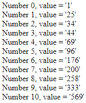
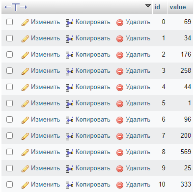
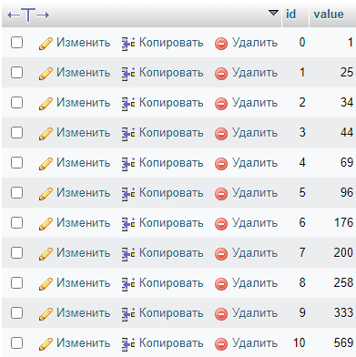

# Отчет по лабораторной работе №5
## Разработка сервисов

#### Цель работы:   
  
Разработать и реализовать алгоритм внешней сортировки. Данные хранятся на сервере в массиве, сервер предоставляет доступ к отдельным элементам. Клиент поочередно запрашивая отдельные ячейки сортирует массив.

#### Пользовательский интерфейс:

Отсортированный массив из базы данных

#### Структура базы данных:

| id | value | 
| -- | ----- |

- **id** : INT(11), PRIMARY KEY (идентификатор значения)
- **value**: int(255) (значение)

**База данных до сортировки**

**База данных после сортировки**

#### Алгоритмы работы: 

Вводим значения в базу данных, код начинает проводить сортировку в соотвествии с задаными параметрами.

### Программный код, реализующий систему

- **Внесение данных в базу данных с помощью SQL**
```
INSERT INTO `sort` (`id`, `value`) VALUES
(0, 69),
(1, 34),
(2, 176),
(3, 258),
(4, 44),
(5, 1),
(6, 96),
(7, 200),
(8, 569),
(9, 25),
(10, 333);
```

- **Используемая сортировка пузырьком**
```php
function bubbleSort() {
    require("connection.php");
    $result = mysqli_query($con, "SELECT DISTINCT * FROM sort"); 
    $size = mysqli_num_rows($result);
    for ($i=0; $i<$size; $i++) {
        for ($j=0; $j<$size-$i-1; $j++) {
            $k = $j+1;
            if (getValue($k) < getValue($j)) {
                $temp = getValue($k);
                setValue($k, getValue($j));
                setValue($j, $temp);
            }
        }
    }
    for ($i=0; $i<$size; $i++) {
        echo("Number $i, value = '".getValue($i)."'");
        echo "<br>";
    }
}
```